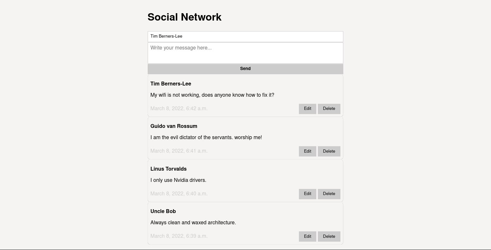

Simple social network using HTML over the Wire architecture in Django with Channels.



## Run 🏃

```
docker-compose up
```

## Thanks 😍

- [Django](https://www.djangoproject.com/)
- [Channels](https://channels.readthedocs.io/en/stable/)
- [Stimulus](https://stimulus.hotwired.dev/)

## Fork 🐑 ➡️ 🐏

[Same project with Stimulus](https://github.com/tanrax/simple-HTML-over-the-Wire-social-network-with-Django-and-stimulus).
